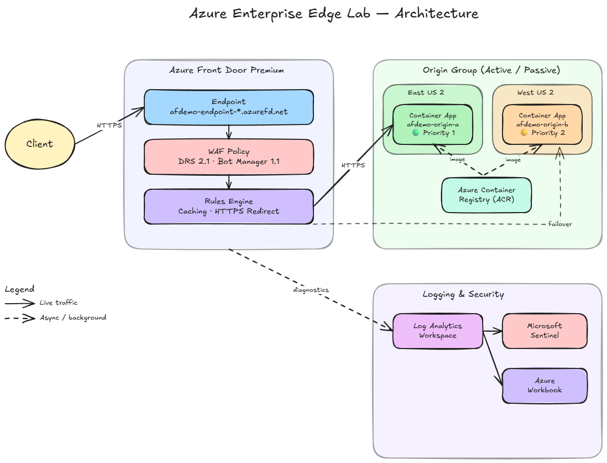
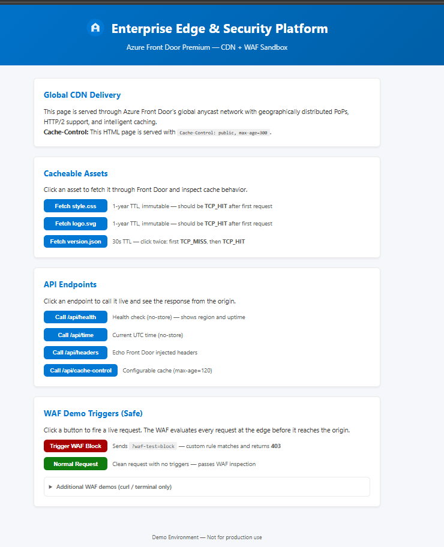

# Azure Enterprise Edge Lab

> End-to-end Azure edge security lab — Front Door Premium with WAF, dual-region Container Apps failover, Microsoft Sentinel, SOC automation, and Azure Workbooks. One-click deploy with Bicep + Azure Developer CLI (azd).

---

## Architecture Overview



See [docs/architecture.md](docs/architecture.md) for component details, caching strategy, WAF rules, and more.

## Prerequisites

Open this repo in the provided **Dev Container** — all required tooling (Azure CLI, azd, Bicep, Node.js, Docker, ShellCheck, hey, jq, OpenSSH) is pre-installed.

## Quickstart

### 1. Login (device code)

```bash
azd auth login --use-device-code
az login --use-device-code
```

### 2. Configure (optional)

```bash
# Defaults are set in .devcontainer/devcontainer.json remoteEnv.
# Override as needed:
export DEMO_PREFIX="afdemo"          # Resource naming prefix (lowercase, no hyphens)
export DEMO_LOCATION_A="eastus2"     # Primary region
export DEMO_LOCATION_B="westus2"     # Secondary region (failover)
export DEMO_RG="rg-afd-demo"         # Resource group name
```

### 3. Deploy

> **Security Copilot** is **not** deployed by default (it bills at ~\$4/hr per SCU).
> To opt in, set the parameter before deploying:
>
> ```bash
> azd env set DEPLOY_SECURITY_COPILOT true
> ```

```bash
azd init              # First time: select environment name, subscription, location
azd up                # Provisions Bicep infra + builds/deploys app to both origins
```



### 4. Run Sandbox Scripts

```bash
# Purge a path and verify cache refresh
bash scripts/purge.sh /static/version.json

# Generate traffic (benign load for rate-limit exercise)
bash scripts/generate-traffic.sh

# Toggle origin failover (disable/enable origin)
bash scripts/toggle-failover.sh disable origin-b
bash scripts/toggle-failover.sh enable origin-b
```

### 5. Destroy

```bash
azd down              # Deletes all provisioned resources
```

## Sandbox Playbook

See [docs/sandbox-playbook.md](docs/sandbox-playbook.md) for a walkthrough with exact commands and expected output.

## Documentation Index

| Document | Description |
|----------|-------------|
| [Architecture](docs/architecture.md) | System architecture and component map |
| [Sandbox Playbook](docs/sandbox-playbook.md) | Walkthrough with commands and expected output |
| [Analytics KQL](docs/analytics-kql.md) | KQL queries for dashboards and ad-hoc analysis |
| [Operating Model](docs/operating-model.md) | RACI, support tiers, SLA-backed incident flow |
| [Migration & Onboarding](docs/migration-onboarding.md) | Phased migration, rollback, DNS cutover |
| [TLS / Certificate Mgmt](docs/tls-certificate-management.md) | Managed vs. BYOC certs, rotation |
| [SOC Automation Stub](docs/soc-automation-stub.md) | Sentinel automation / Logic App skeleton |

## Design Principles

- **No real exploit payloads** — WAF blocking is shown with safe custom headers and benign traffic.
- **Fully idempotent** — deploy and destroy cleanly.
- **Self-contained** — everything needed to deploy is in this repo.
