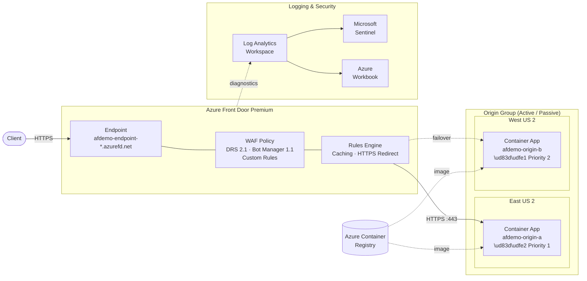

# Architecture — Enterprise Edge + Security Platform

## High-Level Architecture

### Reading the Diagram

| Arrow Style | Meaning |
|-------------|---------|
| **Solid** `→` | Live request traffic |
| **Dashed** `⇢` | Background / async (image pull, log shipping, failover path) |

Traffic flows left-to-right: Internet → Front Door (WAF + caching) → Primary origin. If Origin A fails health probes, Front Door automatically routes to Origin B. Diagnostics stream to Log Analytics, which feeds Sentinel and the operational workbook.

## Component Details

### 1. Azure Front Door Premium

**Global Anycast Network**: 100+ PoPs across 60+ metro areas worldwide. Requests are routed to the nearest PoP via BGP anycast, ensuring sub-50ms first-byte times for most global users.

**Protocol Support**:
- HTTP/1.1, HTTP/2 (full multiplexing)
- HTTP/3 with QUIC (where client supports)
- TLS 1.2 / TLS 1.3
- WebSocket upgrades

**Key Features**:
- Intelligent routing with split TCP optimization
- Real-time health probes (30s intervals, configurable)
- Session affinity (disabled by default for stateless APIs)
- Compression (Brotli, Gzip) for text-based content types

### 2. WAF Policy

The Web Application Firewall runs in **Prevention** mode with:

| Rule Type | Rule Name | Description |
|-----------|-----------|-------------|
| Managed | Microsoft_DefaultRuleSet 2.1 | OWASP Top 10 protection |
| Managed | Microsoft_BotManagerRuleSet 1.1 | Bot classification and management |
| Custom | BlockDemoHeader | Blocks requests with `X-Demo-Block: true` |
| Custom | RateLimitPerIP | Rate limits to 100 req/min per IP |
| Custom | BlockDemoBotUA | Blocks `DemoMaliciousBot/1.0` user-agent |

### 3. Origin Architecture

Two identical Azure Container App instances in separate Azure regions provide:
- **Active/Passive failover**: Origin A (priority 1), Origin B (priority 2)
- **Health probing**: GET /api/health every 30s
- **Container-based deployment**: Source code built via ACR, deployed with `az containerapp up --source`
- **Flexible load balancing**: Configurable weights and priorities

### 4. Caching Strategy

| Path Pattern | Behavior | TTL | Rationale |
|-------------|----------|-----|-----------|
| `/static/*` | Override Always | 1 day | Immutable assets with content hashing |
| `/static/version.json` | Origin (short) | 30s | Frequently rotated; purge-friendly |
| `/api/*` | Honor Origin | Varies | Origin controls via Cache-Control header |
| `/api/health`, `/api/time` | No cache | 0 | Dynamic, must be fresh |
| `/` (root HTML) | Origin | 5 min | Moderate cache for HTML |

### 5. Logging & Observability

- **Front Door Access Log** → Log Analytics (all requests, latency, cache status)
- **WAF Log** → Log Analytics (all WAF evaluations, block/allow actions)
- **Health Probe Log** → Log Analytics (origin health states)
- **Metrics** → Azure Monitor (request count, latency percentiles, cache hit ratio)
- **Azure Workbook** → Pre-built dashboard with traffic, cache, WAF, and health views

### 6. SOC / SIEM Integration

- **Microsoft Sentinel** solution enabled on the Log Analytics workspace (deployed via Bicep)
- **Analytics rules**: created post-deployment via the Azure Portal or CLI (ARM-deployed rules can fail if the workspace hasn't fully onboarded)
- **Automation placeholder**: Logic App skeleton for Teams/email notification (see [soc-automation-stub.md](soc-automation-stub.md))
- **Integration points**: Sentinel data connectors, custom KQL detections

> **Portal path**: Microsoft Sentinel → select the `afdemo-law` workspace → Analytics → Create rule

### 8. Identity & RBAC

Entra ID (Azure AD) integration with role-based access control:

| Role | Scope | Capability |
|------|-------|------------|
| CDN Admin | Resource Group | Full Front Door management |
| Security Operator | WAF + Sentinel | WAF policy changes, alert triage |
| Read-Only Analyst | Resource Group | Dashboard, logs, read-only |

### 9. DDoS Protection

- **Azure DDoS Network Protection** is the recommended tier for enterprise deployments
- Front Door provides built-in DDoS mitigation at the edge layer (L3/L4)
- WAF custom rules provide application-layer (L7) rate limiting
- Telemetry flows to Log Analytics for monitoring and alerting
- Configuration for DDoS Protection Plan is documented but deployment is optional (requires separate enablement at the VNet level)

### 10. Multi-Subdomain Management

The configuration supports multiple custom domains mapped to the same Front Door endpoint:

| Subdomain | Purpose |
|-----------|---------|
| `www.demo.example.com` | Main website |
| `api.demo.example.com` | API endpoints |
| `cdn.demo.example.com` | Static asset delivery |
| `portal.demo.example.com` | Management portal |

> **Note**: These are placeholder configurations. In production, DNS CNAME records would point each subdomain to the Front Door endpoint hostname, and managed TLS certificates would be provisioned automatically.
