# Visual Demo Lab Guide

> Portal-first walkthrough of the Azure Front Door Premium sandbox.
> The live site generates demo traffic and shows results; the Azure portal shows the configuration and telemetry behind it.

---

## Demo Principles

- Run the audience-facing demo entirely in a browser. Provisioning and teardown happen outside the presentation.
- Send all live requests through the Front Door endpoint, never directly to a Container App origin.
- Use the sandbox website for cache, API, origin-region, and safe WAF tests.
- Use the portal to explain Front Door, WAF, origins, rules, diagnostics, and workbooks.
- Expect Front Door configuration changes to take 5-15 minutes and diagnostic logs to take several minutes to appear.

> Screenshots are cropped to the relevant task area. Red callouts identify the action or result; account, tenant, subscription, and unrelated-resource details are excluded.
>
> Stable controls and configuration are pictured below. Workbooks, logs, Sentinel investigations, and optional Security Copilot responses are demonstrated live because their values are session-specific and can contain source IPs or incident details.

## Before the Session

- [ ] Confirm the environment is already deployed and both origins are healthy.
- [ ] In the Azure portal, open the lab resource group (default: `rg-afd-demo`).
- [ ] Open the `afdemo-afd` Front Door profile and select its endpoint hostname to open the sandbox website in a second tab.
- [ ] Open the `afdemowafpolicy` WAF policy in another tab.
- [ ] Open the shared workbooks named `afdemo Front Door Traffic Analytics` and `afdemo WAF Security Analytics`.
- [ ] Click a few website controls at least five minutes before the session so the workbooks have recent data.
- [ ] Keep the interactive architecture diagram available for the opening overview.

> Resource names use the default `afdemo` prefix. If the deployment used another prefix, select the equivalent resources in the same resource group.

---

## Section A: Core Capabilities

### A1. Platform Overview & Architecture

Start with the architecture diagram, then connect each component to a deployed portal resource.

**Steps**:
1. Show the [interactive architecture diagram](architecture/azure-front-door-sandbox.architecture.html).
2. In the Azure portal, open **Resource groups** > `rg-afd-demo`.
3. Point out the Front Door profile, WAF policy, two Container Apps in different regions, Log Analytics workspace, and workbooks.
4. Open `afdemo-afd` and show the Premium SKU and endpoint on **Overview**.
5. Open **Front Door manager** and expand `afdemo-endpoint` to show `default-route` and `default-origin-group`.

**Expected result**: The audience can map the public endpoint to Front Door, its WAF policy, and the two regional origins.

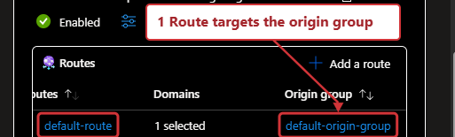

---

### A2. Live CDN Delivery

**Steps**:
1. Switch to the sandbox website opened from the Front Door endpoint.
2. Call out the HTTPS lock and the **Global CDN Delivery** section.
3. Under **Cacheable Assets**, select **Fetch version.json** twice.
4. Compare the displayed `TCP_MISS`/`TCP_HIT` result and `Age` value. An already-warm cache may show a hit on both clicks.
5. Select **Fetch style.css** and **Fetch logo.svg** to show the long-lived static assets.
6. Under **API Endpoints**, select **Call /api/health**, **Call /api/time**, and **Call /api/headers**.

**Expected result**: Static controls display the Front Door cache status and age. API controls return HTTP 200 and identify the serving Azure region without leaving the page.

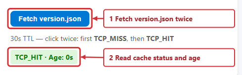

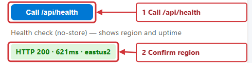

> To show the full health or header payload without a terminal, open `/api/health` or `/api/headers` on the same Front Door hostname in a browser tab.

---

### A3. Cache Override & TTL Policies

**Steps**:
1. In `afdemo-afd`, open **Rule sets** > `CachingRules`.
2. Open `OverrideStaticTTL` and show that `/static/` paths honor the origin cache headers and enable compression.
3. Open `RespectOriginApiCache` and show that `/api/` paths honor the origin while including the query string in the cache key.
4. Return to the website and select **Call /api/cache-control**. The control calls `/api/cache-control?maxage=120` and displays the live response status and region.
5. Optionally open that path in a browser tab to show the JSON `cacheControl` value and generated timestamp.

**Expected result**: The portal rule set explains why static assets and API responses follow different cache policies, and the website demonstrates the API policy live.

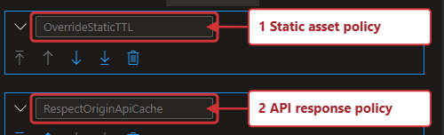

---

### A4. Cache Purge Exercise

**Steps**:
1. On the website, select **Fetch version.json** until it displays `TCP_HIT`; note its age.
2. In the Front Door profile, select **Purge cache**.
3. Select `afdemo-endpoint`, enter `/static/version.json` as the content path, and submit the purge.
4. Wait for the portal notification that the purge was accepted, then return to the website.
5. Select **Fetch version.json** again until the edge reports `TCP_MISS` or an age of `0`.

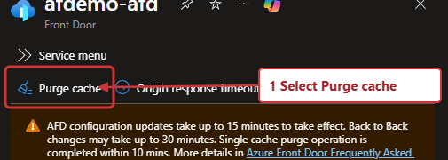

**Expected result**: The same website control changes from a warm-cache result to a cold-cache result after a portal-driven purge.

> Purge completion can take several minutes across edge locations. Use `/static/version.json`, whose 30-second origin TTL makes it the least disruptive demo asset.

---

### A5. Content Deployment Workflow

Keep deployment as an architecture talking point rather than a live coding exercise.

**Steps**:
1. In the resource group, open either Container App and show **Revisions and replicas**.
2. Explain that one application image is deployed to both regional origins.
3. Return to the Front Door profile and show that consumers use one endpoint while deployments happen independently behind it.
4. Reference the cache-purge flow from A4 as the final step after a static-content release.

**Expected result**: The audience sees the deployment boundary and revision history without changing code during the demo.

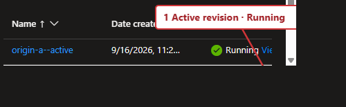

---

### A6. TLS & Certificate Management

**Steps**:
1. On the sandbox website, point out the HTTPS lock and the `azurefd.net` hostname.
2. In `afdemo-afd`, open **Front Door manager**, edit `default-route`, and show **HTTPS redirect** enabled and **Forwarding protocol** set to HTTPS only. Cancel without saving.
3. Open **Domains** and explain that the sandbox intentionally deploys only the default endpoint domain.
4. Use [TLS and certificate management](tls-certificate-management.md) to explain Microsoft-managed certificates versus bring-your-own certificates from Key Vault.

**Expected result**: The live endpoint is HTTPS-only. No domain or certificate changes are made during the demo.

---

### A7. Multi-Subdomain & User Management

**Steps**:
1. In the Front Door profile, open **Domains** and describe the planned `www`, `api`, `cdn`, and `portal` subdomains.
2. Clarify that these names are design placeholders, not deployed custom-domain resources; production onboarding requires DNS validation and route association.
3. Return to `rg-afd-demo` and open **Access control (IAM)** > **Role assignments** to show the current access boundary. Do not add an assignment during the demo.
4. Reference the RACI in [Operating Model](operating-model.md).

**Expected result**: The audience sees where domain onboarding and Azure RBAC are managed without changing the sandbox.

---

## Section B: Security

### B1. WAF Overview & Managed Rules

**Steps**:
1. Open `afdemowafpolicy` from the resource group.
2. On **Overview**, show that the policy is enabled, uses the Premium tier, and runs in **Prevention** mode.
3. Open **Managed rules** and show `Microsoft_DefaultRuleSet` 2.1 and `Microsoft_BotManagerRuleSet` 1.1.
4. Open **Custom rules** and note that lower priority numbers run first.
5. In `afdemo-afd`, open **Security policies** and show that `waf-security-policy` associates the WAF policy with the endpoint for `/*`.

**Expected result**: The policy is globally associated with the demo endpoint and can block matching requests before they reach either origin.

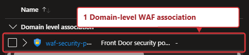

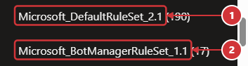

---

### B2. Live WAF Block From the Website

**Steps**:
1. On the website under **WAF Test Triggers (Safe)**, select **Normal Request**.
2. Confirm the page displays **Allowed (HTTP 200)**.
3. Select **Trigger WAF Block**.
4. Confirm the page displays **Blocked by WAF (HTTP 403)**.
5. In the WAF policy, open **Custom rules** > `BlockDemoQueryParam` and show the query-string condition `waf-test=block` and the **Block** action.
6. Repeat each website request a few times to create a visible allow/block pattern for the security workbook.

**Expected result**: Two adjacent website controls produce an allowed request and a blocked request, and the portal shows the exact rule responsible.

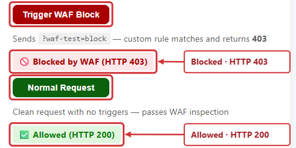

---

### B3. Header and Bot Rules

**Steps**:
1. In **Custom rules**, open `BlockDemoHeader` and show the `X-Demo-Block: true` condition.
2. Open `BlockDemoBotUA` and show the lowercased `demomaliciousbot/1.0` user-agent match.
3. Explain that browsers do not let page JavaScript override these protected headers, so the website uses `BlockDemoQueryParam` for the live visual test.
4. Keep the website's collapsed **Additional WAF exercises** section closed unless someone specifically asks about non-browser testing.

**Expected result**: The audience sees the additional controls in the portal without interrupting the visual demo with terminal requests.

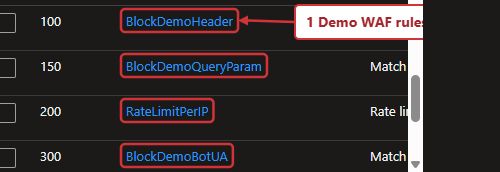

---

### B4. Rate Limiting Exercise

**Steps**:
1. In **Custom rules**, open `RateLimitPerIP`.
2. Show the one-minute window, threshold of 100 requests per client IP, and **Block** action.
3. Explain that this rule protects every path because its request-URI condition matches the whole site.
4. Use recent data in the WAF workbook if rate-limit events were generated before the session; do not generate a burst during the live demo.

**Expected result**: Rate limiting is explained visually from policy configuration and existing telemetry without flooding the shared lab IP.

---

### B5. Origin Failover Exercise

**Steps**:
1. On the website, select **Call /api/health** and note `eastus2`, the primary region.
2. In `afdemo-afd`, open **Origin groups** > `default-origin-group` and show `origin-a` at priority 1 and `origin-b` at priority 2.
3. Open the `afdemo-origin-a` Container App in a separate portal tab and confirm its status is **Running**.
4. On **Overview**, select **Stop** and confirm the action.
5. Return to the website and select **Call /api/health** about every 30 seconds.
6. After Front Door marks the primary unhealthy, confirm that requests return HTTP 200 from `westus2`.
7. Immediately return to `afdemo-origin-a`, select **Start**, and confirm the action.
8. Continue checking **Call /api/health** until `eastus2` is serving again, then verify both origins are enabled in `default-origin-group`.

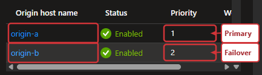

**Expected result**: The public hostname stays the same while the displayed serving region changes from `eastus2` to `westus2`, then returns to `eastus2` after recovery.

> Stopping the primary Container App makes its health endpoint unavailable. With 30-second probes and three successful samples required, detection usually takes about 90-120 seconds. A few requests can fail while the edge converges, so narrate retries as health-probe detection rather than an instant switch.
>
> Do not disable `origin-a` in the Front Door origin editor for the live path. That is a configuration change and usually takes 5-15 minutes to propagate. Always restart the primary Container App before leaving this section.

---

### B6. DDoS Protection

**Steps**:
1. Return to the Front Door profile and explain that the public application is exposed through Microsoft's global edge rather than through the origin hostnames.
2. Show the WAF association and prevention mode as the application-layer control demonstrated in B2.
3. Use the [architecture guide](architecture.md) to distinguish Front Door platform protection from Azure DDoS Network Protection for VNet-hosted resources.

**Expected result**: This is a configuration walkthrough only; no denial-of-service traffic is generated.

---

## Section C: Observability & SOC

### C1. Visual Traffic and WAF Analytics

**Steps**:
1. Make several cache, API, normal WAF, and blocked WAF requests from the sandbox website.
2. In the resource group, open the shared workbook `afdemo Front Door Traffic Analytics`.
3. Set the time range to **Last 24 hours** and select **Refresh**.
4. Show request volume, latency percentiles, cache hit ratio, HTTP status distribution, geography, and origin health.
5. Open `afdemo WAF Security Analytics`, use the same time range, and show blocked requests, top rules, source IPs, and countries.
6. Optionally open `afdemo Front Door CDN WAF Dashboard` for the consolidated operational view.

**Expected result**: Website interactions appear as traffic and security evidence after diagnostic-log ingestion completes.

> If a chart is empty, widen the time range, select **Refresh**, and allow several minutes for ingestion. The workbooks are the primary demo surface; no query is required.

**Optional portal investigation**:
1. Open `afdemo-law` > **Logs**.
2. Paste one query from [Analytics KQL Queries](analytics-kql.md) into the portal query editor and select **Run**.
3. Keep this step for technical audiences that want to move from a chart to its underlying records.

---

### C2. SOC / Sentinel Integration

**Steps**:
1. Open **Microsoft Sentinel** and select the `afdemo-law` workspace.
2. On **Overview**, show that Sentinel is onboarded to the same workspace used by the Front Door workbooks.
3. Open **Content hub** and show the installed **Azure Web Application Firewall** and **Network Session Essentials** solutions.
4. Open **Logs** or **Hunting** to show where WAF telemetry can support investigation.
5. Open **Analytics** to explain where a scheduled detection would be created; do not create one during the visual demo.
6. Use [SOC Automation Stub](soc-automation-stub.md) as the target workflow for incident creation and response automation.

**Expected result**: Sentinel and its content are active on `afdemo-law`. A custom scheduled analytics rule and automated incident are not assumed to be deployed.

---

### C3. Security Copilot — AI-Assisted SOC (Live)

**Optional prerequisite**: This section requires the opt-in `afdemo-seccopilot` capacity, Security Copilot access, and the Microsoft Sentinel plugin to be configured before the session. The default deployment does not create paid capacity.

**Steps**:

1. **Open Microsoft Security Copilot**
   Open the standalone experience or the embedded experience in Microsoft Sentinel.

2. **Natural Language KQL — Live Query**
   Type this prompt into Copilot:
   > *"Show me all WAF block events from the last hour, grouped by source IP and rule name"*

   Compare the response with the WAF workbook or the equivalent query in [Analytics KQL Queries](analytics-kql.md).

3. **Optional Incident Summarization**
   If the facilitator created a Sentinel incident before the session, ask:
   > *"Summarize the latest Sentinel incident related to WAF blocks"*

   Skip this prompt when no pre-seeded incident exists; the website WAF test creates logs, not an incident by itself.

4. **Threat Intelligence Lookup**
   Pick a source IP from the WAF workbook and ask:
   > *"What do we know about this IP? Check threat intelligence."*

5. **Guided Response Recommendation**
   If an incident is available, ask:
   > *"What response actions do you recommend for this incident?"*

**Expected result**: When the optional capacity and plugins are ready, Copilot can investigate the same WAF evidence shown visually in the workbooks.

---

## Section D: Additional Resources

### D1. Migration & Onboarding

See [Migration and Onboarding](migration-onboarding.md) for the full phased migration plan:
assessment → parallel run → DNS cutover → validation → decommission

---

### D2. Operating Model & SLA

See [Operating Model](operating-model.md) for:
RACI matrix, support tiers, SLA-backed response times, escalation path

---

### D3. Future Enhancements

Potential additions to this sandbox:
- Private Link origins
- Azure Policy governance
- Logic App playbook automation

---

## After the Session

1. Confirm `afdemo-origin-a` is active and the website health control reports `eastus2`.
2. Leave the environment running if it is shared with another session.
3. When deletion is approved, open **Resource groups** > `rg-afd-demo` > **Delete resource group**.
4. Review the resource list, enter the resource-group name when prompted, and confirm deletion.

Front Door Premium profiles can take 15-25 minutes to delete. Monitor **Notifications** or the resource group's **Activity log** rather than repeating the delete action.
